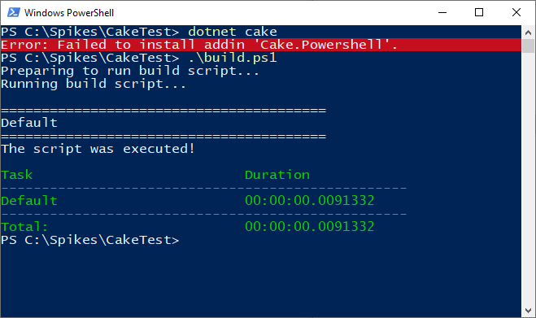

# Minimal working example that the bootstrapper build.ps1 behaves differnt than the dotnet cake-tool
This is a minimal working example to show the difference between the `build.ps1` file and `dotnet cake` tool.

Pinning of the cake version does not make any difference for the `build.ps1` apporach but I pinned it anyway. This also happens with 0.38.1.

